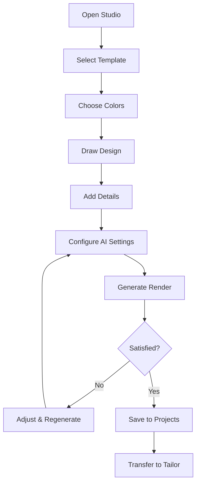
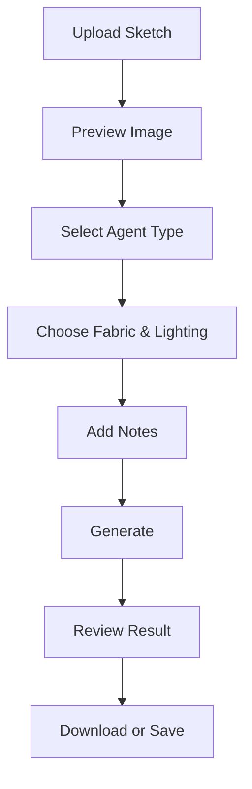
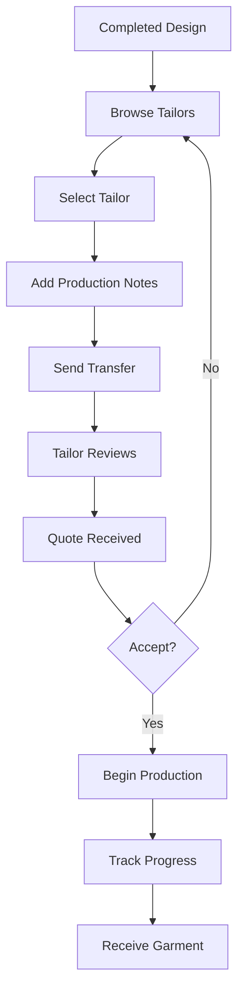

# TailorX - AI-Powered Fashion Design Studio

## Complete Application Documentation

---

## 📋 Table of Contents

1. [Executive Summary](#executive-summary)
2. [Problem Statement](#problem-statement)
3. [Solution Overview](#solution-overview)
4. [Target Users](#target-users)
5. [Core Features](#core-features)
6. [Technical Architecture](#technical-architecture)
7. [User Workflows](#user-workflows)
8. [Database Schema](#database-schema)
9. [API & Edge Functions](#api--edge-functions)
10. [Security & Authentication](#security--authentication)
11. [Future Roadmap](#future-roadmap)

---

## 🎯 Executive Summary

**TailorX** is an AI-powered fashion design ecosystem that bridges the gap between creative vision and professional garment production. The platform enables fashion designers, hobbyists, and entrepreneurs to:

- **Create** original fashion designs using digital drawing tools
- **Transform** rough sketches into photorealistic garment renders using AI
- **Connect** with professional tailors to bring designs to life
- **Source** quality materials from verified suppliers
- **Track** orders from conception to delivery

The flagship feature, **Chromatique Studio**, is a comprehensive design workspace that combines traditional digital art tools with cutting-edge AI generation capabilities.

---

## 🔍 Problem Statement

### The Fashion Design Gap

The fashion industry faces several critical challenges that TailorX addresses:

### 1. **Visualization Barrier**
| Problem | Impact |
|---------|--------|
| Designers struggle to communicate their vision | Misinterpretation leads to costly production errors |
| Rough sketches don't convey fabric, lighting, or detail | Clients can't visualize the final product |
| Professional rendering requires expensive software and skills | Small designers are priced out of the market |

### 2. **Production Disconnect**
| Problem | Impact |
|---------|--------|
| Finding skilled tailors is difficult | Quality varies dramatically |
| Communication between designer and tailor is fragmented | Details get lost in translation |
| No centralized platform for the design-to-production pipeline | Inefficient workflows waste time and money |

### 3. **Material Sourcing Challenges**
| Problem | Impact |
|---------|--------|
| Finding quality fabrics requires industry connections | Independent designers struggle to source materials |
| No way to visualize materials on designs before purchase | Wrong material choices lead to failed designs |
| Scattered suppliers with no verification | Quality and reliability concerns |

### 4. **Workflow Fragmentation**
| Problem | Impact |
|---------|--------|
| Designers use multiple disconnected tools | Files get lost, versions conflict |
| No single source of truth for projects | Collaboration is difficult |
| Manual tracking of orders and revisions | Time wasted on administration |

---

## 💡 Solution Overview

TailorX solves these problems through an integrated platform:

```
┌─────────────────────────────────────────────────────────────────┐
│                        TailorX Ecosystem                        │
├─────────────────────────────────────────────────────────────────┤
│                                                                 │
│  ┌─────────────┐    ┌─────────────┐    ┌─────────────┐         │
│  │  DESIGN     │───▶│  GENERATE   │───▶│  PRODUCE    │         │
│  │  (Studio)   │    │  (AI)       │    │  (Tailors)  │         │
│  └─────────────┘    └─────────────┘    └─────────────┘         │
│         │                  │                  │                 │
│         ▼                  ▼                  ▼                 │
│  ┌─────────────┐    ┌─────────────┐    ┌─────────────┐         │
│  │  Canvas     │    │  Renders    │    │  Orders     │         │
│  │  Drawing    │    │  Preview    │    │  Tracking   │         │
│  │  Templates  │    │  Variations │    │  Delivery   │         │
│  └─────────────┘    └─────────────┘    └─────────────┘         │
│                                                                 │
│  ┌─────────────────────────────────────────────────────────────┐│
│  │                    MATERIALS MARKETPLACE                    ││
│  │         Browse • Sample • Purchase • Track                  ││
│  └─────────────────────────────────────────────────────────────┘│
└─────────────────────────────────────────────────────────────────┘
```

---

## 👥 Target Users

### Primary Users

| User Type | Description | Key Needs |
|-----------|-------------|-----------|
| **Fashion Designers** | Professional and aspiring designers | Quick visualization, client presentations, production connection |
| **Fashion Students** | Learning design and production | Practice tools, affordable AI rendering, portfolio building |
| **Entrepreneurs** | Starting clothing lines | End-to-end platform, cost-effective production |
| **Hobbyists** | Creative individuals making personal garments | Easy-to-use tools, tailor connections |

### Secondary Users

| User Type | Description | Key Needs |
|-----------|-------------|-----------|
| **Tailors** | Skilled garment producers | Client acquisition, clear specifications, order management |
| **Material Suppliers** | Fabric and accessory vendors | Market access, order fulfillment, brand visibility |
| **Fashion Clients** | End consumers wanting custom clothing | Designer access, visualization, quality assurance |

---

## ⭐ Core Features

### 1. Chromatique Studio (Design Workspace)

The heart of TailorX is the **Chromatique Studio** - a full-featured design environment.

#### Drawing Canvas (Fabric.js)

```typescript
// Canvas capabilities
interface CanvasFeatures {
  tools: {
    pencil: "Freehand drawing with pressure sensitivity";
    brush: "Smooth strokes with customizable size/opacity";
    eraser: "Remove unwanted marks";
    shapes: "Rectangle, circle, line, triangle";
    text: "Add labels and notes";
    eyedropper: "Pick colors from canvas";
    fill: "Flood fill areas with color";
  };
  
  controls: {
    undo: "Step backward through history";
    redo: "Step forward through history";
    zoom: "0.1x to 3x magnification";
    clear: "Reset canvas";
    grid: "Toggle alignment grid";
    guides: "Toggle smart guides";
  };
  
  export: {
    formats: ["PNG", "JPG", "SVG", "PDF"];
    resolution: "Up to 4K output";
    dataUrl: "Base64 for AI processing";
  };
}
```

#### Template System

Pre-designed garment silhouettes users can draw over:

| Category | Templates |
|----------|-----------|
| **Tops** | T-shirt, Blouse, Shirt, Tank Top, Sweater |
| **Dresses** | A-Line, Sheath, Maxi, Midi, Cocktail |
| **Pants** | Jeans, Trousers, Shorts, Leggings |
| **Outerwear** | Jacket, Coat, Blazer, Vest |
| **Accessories** | Bags, Hats, Scarves |
| **Croquis** | Male, Female, Child figure forms |

#### Workflow Stages

The studio guides users through a structured design process:

```
COLOR → SKETCH → DETAIL → REFINE → PRESENT
  │        │        │        │         │
  ▼        ▼        ▼        ▼         ▼
Palette  Outline  Features  Polish   Export
Select   Drawing  Textures  Review   Share
Mood     Forms    Patterns  Adjust   Generate
```

---

### 2. AI Generation System

#### How It Works

```
┌──────────────────────────────────────────────────────────────┐
│                    AI Generation Pipeline                     │
├──────────────────────────────────────────────────────────────┤
│                                                              │
│  INPUT                    PROCESSING              OUTPUT     │
│  ─────                    ──────────              ──────     │
│                                                              │
│  ┌─────────┐             ┌─────────────┐      ┌─────────┐   │
│  │ Sketch  │────────────▶│ Downscale   │      │ Photo-  │   │
│  │ (base64)│             │ (max 1024px)│      │ realistic│   │
│  └─────────┘             └──────┬──────┘      │ Render  │   │
│                                 │             └────▲────┘   │
│  ┌─────────┐             ┌──────▼──────┐          │         │
│  │ Style   │────────────▶│ Prompt      │          │         │
│  │ Settings│             │ Construction│          │         │
│  └─────────┘             └──────┬──────┘          │         │
│                                 │                  │         │
│  ┌─────────┐             ┌──────▼──────┐          │         │
│  │ Agent   │────────────▶│ Lovable AI  │──────────┘         │
│  │ Type    │             │ Gateway     │                    │
│  └─────────┘             └─────────────┘                    │
│                                                              │
└──────────────────────────────────────────────────────────────┘
```

#### Generation Settings

| Setting | Options | Effect |
|---------|---------|--------|
| **Agent Type** | Realistic, Artistic, Minimalist, Avant-Garde | Controls the AI's interpretation style |
| **Fabric Type** | Cotton, Silk, Denim, Leather, Wool, Linen, Velvet, Synthetic | Texture and material rendering |
| **Lighting Style** | Studio, Natural, Dramatic, Soft, Golden Hour | Mood and atmosphere |
| **Detail Level** | 0-100% slider | Amount of fine detail in output |
| **Additional Notes** | Free-form text | Custom instructions for the AI |

#### Rate Limit Handling

The system gracefully handles API limits:

```typescript
// Retry strategy
const retryConfig = {
  maxAttempts: 3,
  backoffStrategy: "exponential",
  initialDelay: 30, // seconds
  maxDelay: 120, // seconds
  userFeedback: {
    showCountdown: true,
    showProgress: true,
    allowCancel: true
  }
};
```

---

### 3. Generation Queue System

For authenticated users, generations are queued and processed reliably:

```
┌─────────────────────────────────────────────────────────┐
│                   Generation Queue                       │
├─────────────────────────────────────────────────────────┤
│                                                         │
│  PENDING      PROCESSING       COMPLETED      FAILED    │
│  ───────      ──────────       ─────────      ──────    │
│                                                         │
│  [🕐 Item 3]  [⚙️ Item 2]     [✅ Item 1]   [❌ Item 0] │
│  [🕐 Item 4]                   [✅ Item 5]   [🔄 Retry] │
│  [🕐 Item 5]                   [✅ Item 6]              │
│                                                         │
│  ┌─────────────────────────────────────────────────────┐│
│  │ Real-time updates via Supabase subscriptions       ││
│  │ Toast notifications on completion/failure          ││
│  │ Remove, retry, or download from queue             ││
│  └─────────────────────────────────────────────────────┘│
└─────────────────────────────────────────────────────────┘
```

---

### 4. Saved Designs System

Persistent storage for user work:

```typescript
interface SavedDesign {
  id: string;           // Unique identifier
  name: string;         // User-given name
  canvas_data: JSON;    // Complete Fabric.js state
  thumbnail_url: string; // Preview image
  sketch_data: string;  // Base64 sketch
  generated_image: string; // AI render result
  
  // Generation settings
  fabric_type: string;
  lighting_style: string;
  detail_level: number;
  agent_type: string;
  additional_notes: string;
  
  // Metadata
  created_at: Date;
  updated_at: Date;
}
```

Features:
- ✅ Save current design with custom name
- ✅ Load any saved design to canvas
- ✅ Rename existing designs
- ✅ Delete unwanted designs
- ✅ Thumbnail previews for visual browsing
- ✅ Auto-save on significant changes (optional)

---

### 5. Tailor Marketplace

Connect designers with production professionals:

| Feature | Description |
|---------|-------------|
| **Tailor Profiles** | Specialties, portfolio, ratings, location |
| **Transfer System** | Send rendered designs to tailors with notes |
| **Quote Requests** | Get pricing from multiple tailors |
| **Order Tracking** | Status updates from production to delivery |
| **Messaging** | Direct communication with tailors |

---

### 6. Materials Marketplace

Source quality fabrics and accessories:

| Feature | Description |
|---------|-------------|
| **Catalog** | Browse fabrics by type, color, weight, price |
| **Samples** | Order swatches before committing |
| **Bulk Ordering** | Quantity discounts for production runs |
| **Supplier Ratings** | Verified quality and reliability scores |
| **Wishlist** | Save materials for future projects |

---

## 🏗️ Technical Architecture

### Frontend Stack

```
┌─────────────────────────────────────────────────────────┐
│                    Frontend Layer                        │
├─────────────────────────────────────────────────────────┤
│                                                         │
│  ┌─────────────┐  ┌─────────────┐  ┌─────────────┐     │
│  │   React 18  │  │  TypeScript │  │    Vite     │     │
│  │   SPA       │  │   Strict    │  │   Bundler   │     │
│  └─────────────┘  └─────────────┘  └─────────────┘     │
│                                                         │
│  ┌─────────────┐  ┌─────────────┐  ┌─────────────┐     │
│  │ Tailwind    │  │  shadcn/ui  │  │ Fabric.js   │     │
│  │ CSS         │  │  Components │  │ Canvas      │     │
│  └─────────────┘  └─────────────┘  └─────────────┘     │
│                                                         │
│  ┌─────────────┐  ┌─────────────┐  ┌─────────────┐     │
│  │ React       │  │  TanStack   │  │   Sonner    │     │
│  │ Router v6   │  │  Query      │  │   Toasts    │     │
│  └─────────────┘  └─────────────┘  └─────────────┘     │
│                                                         │
└─────────────────────────────────────────────────────────┘
```

### Backend Stack (Lovable Cloud)

```
┌─────────────────────────────────────────────────────────┐
│                  Lovable Cloud (Supabase)               │
├─────────────────────────────────────────────────────────┤
│                                                         │
│  ┌─────────────────────────────────────────────────────┐│
│  │                   PostgreSQL                        ││
│  │  • designs table (saved work)                       ││
│  │  • generations table (AI queue)                     ││
│  │  • profiles table (user data)                       ││
│  │  • rendered_projects table (final renders)          ││
│  │  • tailor_transfers table (production orders)       ││
│  └─────────────────────────────────────────────────────┘│
│                                                         │
│  ┌─────────────────────────────────────────────────────┐│
│  │                  Edge Functions                     ││
│  │  • sketch-to-render (AI generation)                 ││
│  │  • design-assistant (canvas AI helper)              ││
│  │  • generate-fashion (alternative endpoint)          ││
│  │  • health (service monitoring)                      ││
│  └─────────────────────────────────────────────────────┘│
│                                                         │
│  ┌─────────────────────────────────────────────────────┐│
│  │                  Auth & Security                    ││
│  │  • Email/password authentication                    ││
│  │  • Row-Level Security (RLS) policies                ││
│  │  • JWT-based session management                     ││
│  └─────────────────────────────────────────────────────┘│
│                                                         │
│  ┌─────────────────────────────────────────────────────┐│
│  │                  Realtime                           ││
│  │  • Generation status subscriptions                  ││
│  │  • Live queue updates                               ││
│  └─────────────────────────────────────────────────────┘│
│                                                         │
└─────────────────────────────────────────────────────────┘
```

### AI Integration

```
┌─────────────────────────────────────────────────────────┐
│                   AI Gateway                             │
├─────────────────────────────────────────────────────────┤
│                                                         │
│  ┌─────────────────────────────────────────────────────┐│
│  │              Lovable AI Gateway                     ││
│  │                                                     ││
│  │  Primary Model: google/gemini-3-pro-image-preview   ││
│  │                                                     ││
│  │  • Managed rate limiting                            ││
│  │  • Automatic failover                               ││
│  │  • No API key required                              ││
│  │  • Optimized for fashion rendering                  ││
│  └─────────────────────────────────────────────────────┘│
│                                                         │
└─────────────────────────────────────────────────────────┘
```

---

## 🔄 User Workflows

### Workflow 1: Design from Scratch



### Workflow 2: Upload & Enhance



### Workflow 3: Production Pipeline



---

## 🗄️ Database Schema

### Entity Relationship Diagram

```
┌─────────────────┐       ┌─────────────────┐
│     profiles    │       │     designs     │
├─────────────────┤       ├─────────────────┤
│ id (PK)         │       │ id (PK)         │
│ user_id (FK)    │◄──────│ user_id (FK)    │
│ full_name       │       │ name            │
│ avatar_url      │       │ canvas_data     │
│ created_at      │       │ sketch_data     │
│ updated_at      │       │ generated_image │
└─────────────────┘       │ fabric_type     │
                          │ lighting_style  │
                          │ detail_level    │
                          │ agent_type      │
                          │ additional_notes│
                          │ thumbnail_url   │
                          │ created_at      │
                          │ updated_at      │
                          └────────┬────────┘
                                   │
                                   ▼
┌─────────────────┐       ┌─────────────────┐
│   generations   │       │rendered_projects│
├─────────────────┤       ├─────────────────┤
│ id (PK)         │       │ id (PK)         │
│ user_id (FK)    │       │ user_id (FK)    │
│ sketch_data     │       │ design_id (FK)  │──┘
│ fabric_type     │       │ name            │
│ lighting_style  │       │ rendered_image  │
│ detail_level    │       │ source_sketch   │
│ agent_type      │       │ prompt          │
│ additional_notes│       │ style           │
│ status          │       │ created_at      │
│ generated_image │       │ updated_at      │
│ error_message   │       └────────┬────────┘
│ retry_count     │                │
│ created_at      │                ▼
│ updated_at      │       ┌─────────────────┐
└─────────────────┘       │tailor_transfers │
                          ├─────────────────┤
                          │ id (PK)         │
                          │ user_id (FK)    │
                          │ project_id (FK) │──┘
                          │ tailor_id       │
                          │ tailor_name     │
                          │ status          │
                          │ notes           │
                          │ created_at      │
                          │ updated_at      │
                          └─────────────────┘
```

### Row-Level Security (RLS)

All tables are protected with RLS policies ensuring users can only access their own data:

```sql
-- Example policy for designs table
CREATE POLICY "Users can view their own designs"
ON public.designs FOR SELECT
USING (auth.uid() = user_id);

CREATE POLICY "Users can create their own designs"
ON public.designs FOR INSERT
WITH CHECK (auth.uid() = user_id);

CREATE POLICY "Users can update their own designs"
ON public.designs FOR UPDATE
USING (auth.uid() = user_id);

CREATE POLICY "Users can delete their own designs"
ON public.designs FOR DELETE
USING (auth.uid() = user_id);
```

---

## 🔌 API & Edge Functions

### sketch-to-render

**Purpose:** Transform sketches into photorealistic fashion renders

```typescript
// Request
POST /functions/v1/sketch-to-render
{
  "sketchImage": "data:image/png;base64,...",
  "prompt": "string (optional)",
  "agentType": "realistic" | "artistic" | "minimalist" | "avant-garde",
  "fabricType": "cotton" | "silk" | "denim" | ...,
  "lightingStyle": "studio" | "natural" | "dramatic" | ...,
  "detailLevel": 0-100,
  "additionalNotes": "string (optional)"
}

// Response (success)
{
  "success": true,
  "generatedImage": "https://...",
  "description": "AI-generated description of the render"
}

// Response (rate limited)
{
  "success": false,
  "error": "Rate limit exceeded",
  "retryAfter": 30
}
```

### design-assistant

**Purpose:** Natural language canvas manipulation

```typescript
// Request
POST /functions/v1/design-assistant
{
  "prompt": "Add a peter pan collar in white",
  "context": "Current design is a blue cotton dress",
  "mode": "action" | "suggest",
  "canvasState": { /* Fabric.js JSON */ }
}

// Response (action mode)
{
  "actions": [
    {
      "type": "addShape",
      "params": { "shape": "path", "color": "#FFFFFF", ... }
    }
  ],
  "explanation": "Added a white peter pan collar..."
}

// Response (suggest mode)
{
  "suggestions": [
    "Consider adding lace trim for elegance",
    "A contrasting belt would define the waist"
  ]
}
```

### health

**Purpose:** Service monitoring

```typescript
// Request
GET /functions/v1/health

// Response
{
  "status": "ok",
  "timestamp": "2025-01-21T..."
}
```

---

## 🔐 Security & Authentication

### Authentication Flow

```
┌─────────────────────────────────────────────────────────┐
│                   Auth Flow                              │
├─────────────────────────────────────────────────────────┤
│                                                         │
│  ┌──────────┐    ┌──────────┐    ┌──────────┐          │
│  │  Sign Up │───▶│  Verify  │───▶│  Profile │          │
│  │  Form    │    │  Email   │    │  Created │          │
│  └──────────┘    └──────────┘    └──────────┘          │
│                  (auto-confirm)                         │
│                                                         │
│  ┌──────────┐    ┌──────────┐    ┌──────────┐          │
│  │  Log In  │───▶│   JWT    │───▶│  Access  │          │
│  │  Form    │    │  Issued  │    │  Granted │          │
│  └──────────┘    └──────────┘    └──────────┘          │
│                                                         │
└─────────────────────────────────────────────────────────┘
```

### Protected Routes

| Route | Protection Level | Access |
|-------|------------------|--------|
| `/` | Public | Everyone |
| `/auth` | Public | Everyone |
| `/templates` | Public | Everyone |
| `/tailors` | Public | Everyone |
| `/materials` | Public | Everyone |
| `/studio` | Protected | Authenticated users only |
| `/orders` | Protected | Authenticated users only |

### Data Security

1. **Row-Level Security (RLS):** All database tables have policies ensuring users can only access their own data
2. **JWT Validation:** All authenticated requests include a valid JWT token
3. **HTTPS:** All communications are encrypted in transit
4. **Input Validation:** All inputs are validated before processing
5. **Rate Limiting:** API endpoints are protected against abuse

---

## 🚀 Future Roadmap

### Phase 1: Enhanced Studio (Q1 2025)
- [ ] Collaborative design sessions
- [ ] Version history with visual diff
- [ ] Advanced layer effects (blend modes, filters)
- [ ] More garment templates

### Phase 2: Production Pipeline (Q2 2025)
- [ ] Full tailor onboarding flow
- [ ] Integrated messaging system
- [ ] Quote comparison tools
- [ ] Production milestone tracking

### Phase 3: Marketplace Expansion (Q3 2025)
- [ ] Material supplier onboarding
- [ ] Sample request system
- [ ] Integrated checkout
- [ ] Supplier ratings & reviews

### Phase 4: AI Enhancement (Q4 2025)
- [ ] Style transfer between designs
- [ ] Automatic pattern generation
- [ ] Size/fit visualization
- [ ] Trend analysis & suggestions

### Phase 5: Mobile & Community (2026)
- [ ] Native mobile app
- [ ] Designer portfolios
- [ ] Community gallery
- [ ] Design challenges & competitions

---

## 📊 Success Metrics

| Metric | Target | Description |
|--------|--------|-------------|
| **User Retention** | 60% | Monthly active users returning |
| **Generation Success** | 95% | AI renders completing without error |
| **Tailor Connections** | 1000+ | Verified tailors on platform |
| **Design Saves** | 10/user | Average saved designs per user |
| **Production Orders** | 500/month | Designs sent to production |

---

## 📝 Conclusion

TailorX represents a paradigm shift in how fashion design moves from concept to production. By combining intuitive design tools, powerful AI rendering, and a connected marketplace, we're removing barriers that have historically prevented independent designers from bringing their visions to life.

The platform serves as a bridge between creativity and craft, empowering designers of all skill levels to create, visualize, and produce professional-quality garments.

---

**Documentation Version:** 1.0  
**Last Updated:** January 21, 2025  
**Maintained By:** TailorX Development Team
